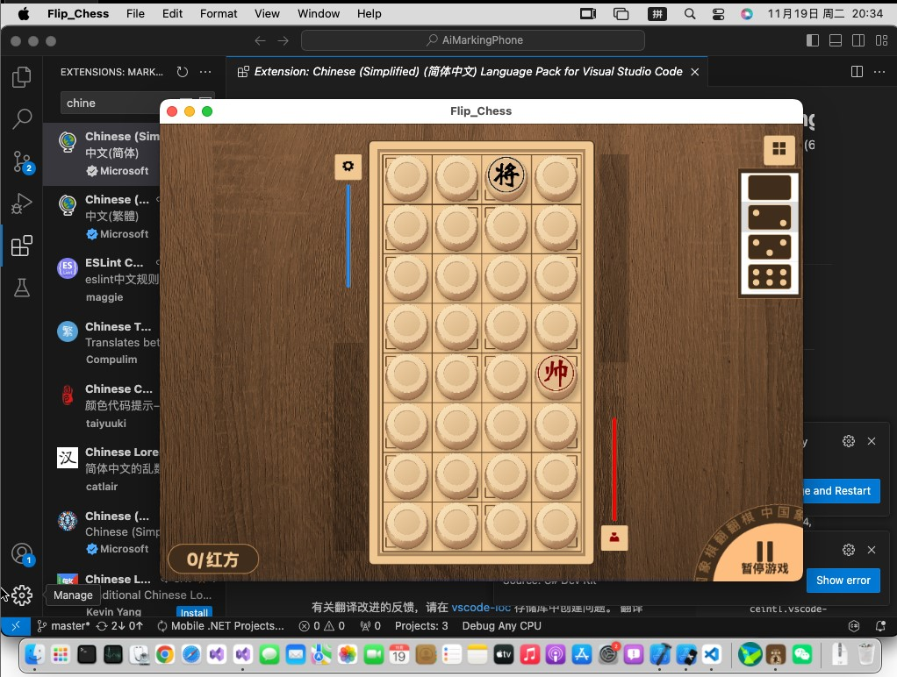

# Flip-Chess-MAUI

 
 Windows 10 app store address: 
[Buy Flip Chess - Microsoft Store](https://apps.microsoft.com/detail/9pfm18fl44ff)   

Android app download address: releases (**com.companyname.flip_chess.apk**)

mac OS app download address: releases (**Flip_Chess-1.0.pkg**)

 

## Function description

Flip Chess is a free and open source Chinese chess flip chess game.

 

## Development environment

|Key|Value|
|:-|:-|
|System requirements| .net 7.0 Update or upper|
|Development tool|Visual Studio 2022|
|Programing language|C#|

 

## Deployment instructions

> Download the whole project, open `Flip Chess.sln`, start the project `Flip Chess`, and try to see if it works.