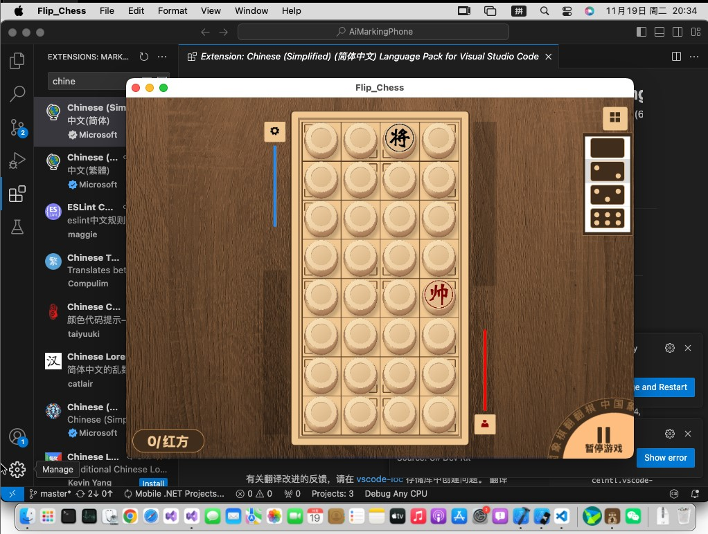

# 翻翻棋-MAUI

 Windows 10 app 应用商店地址: 
[购置 翻棋 - 微软商店](https://apps.microsoft.com/detail/9pfm18fl44ff)   

Android app 下载地址: releases (**com.companyname.flip_chess.apk**)

mac OS app 下载地址: releases (**Flip_Chess-1.0.pkg**)

 

## 功能说明

翻翻棋 是一款免费开源的中国象棋翻翻棋游戏。

 

## 开发环境

|Key|Value|
|:-|:-|
|系统要求| .net 7.0 或更高|
|开发工具|Visual Studio 2022|
|编程语言|C#|

 

## 部署说明

> 下载整个工程，打开`Flip_Chess.sln`文件，启动工程`Flip_Chess`，试试看是否可以工作。